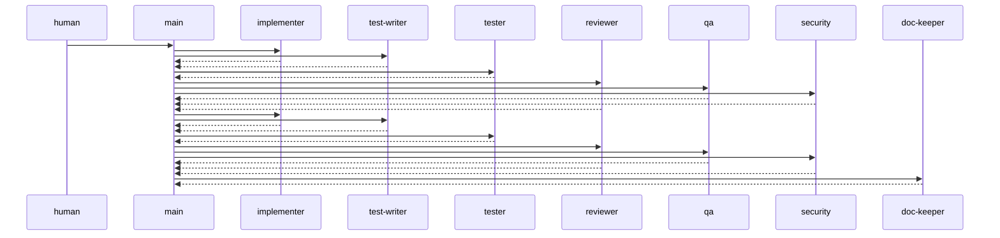

# 메시지 흐름

```mermaid
sequenceDiagram
    participant Human as human
    participant Main as main
    participant implementer as implementer
    participant test-writer as test-writer
    participant tester as tester
    participant reviewer as reviewer
    participant qa as qa
    participant security as security
    participant doc-keeper as doc-keeper
    Human->>Main: #1 H-INPUT (~31 tok)
    Main->>implementer: #2 T-TASK (~766 tok)
    Main->>test-writer: #3 T-TASK (~817 tok)
    implementer-->>Main: #4 R-DONE (~1418 tok)
    test-writer-->>Main: #5 R-DONE (~2119 tok)
    Main->>tester: #6 T-TASK (~196 tok)
    tester-->>Main: #7 R-DONE (~102 tok)
    Main->>reviewer: #8 T-TASK (~242 tok)
    Main->>qa: #9 T-TASK (~271 tok)
    Main->>security: #10 T-TASK (~205 tok)
    qa-->>Main: #11 R-FINDINGS (~1539 tok)
    security-->>Main: #12 R-FINDINGS (~2773 tok)
    reviewer-->>Main: #13 R-FINDINGS (~2317 tok)
    Main->>implementer: #14 T-FIX (~660 tok)
    Main->>test-writer: #15 T-FIX (~650 tok)
    implementer-->>Main: #16 R-DONE (~612 tok)
    test-writer-->>Main: #17 R-DONE (~1268 tok)
    Main->>tester: #18 T-RERUN (~277 tok)
    tester-->>Main: #19 R-DONE (~174 tok)
    Main->>reviewer: #20 T-REREVIEW (~322 tok)
    Main->>qa: #21 T-REREVIEW (~359 tok)
    Main->>security: #22 T-REREVIEW (~420 tok)
    qa-->>Main: #23 R-FINDINGS (~971 tok)
    reviewer-->>Main: #24 R-FINDINGS (~1540 tok)
    security-->>Main: #25 R-FINDINGS (~2791 tok)
    Main->>doc-keeper: #26 T-TASK (~456 tok)
    doc-keeper-->>Main: #27 R-DONE (~444 tok)
```
