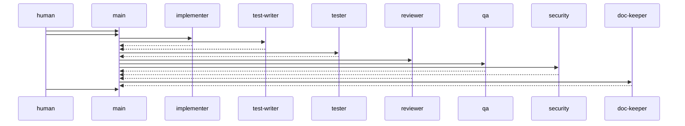

# 메시지 흐름

```mermaid
sequenceDiagram
    participant Human as human
    participant Main as main
    participant implementer as implementer
    participant test-writer as test-writer
    participant tester as tester
    participant reviewer as reviewer
    participant qa as qa
    participant security as security
    participant doc-keeper as doc-keeper
    Human->>Main: #1 H-INPUT (~32 tok)
    Human->>Main: #2 H-INPUT (~4 tok)
    Main->>implementer: #3 T-TASK (~621 tok)
    Main->>test-writer: #4 T-TASK (~685 tok)
    implementer-->>Main: #5 R-DONE (~1198 tok)
    test-writer-->>Main: #6 R-DONE (~2035 tok)
    Main->>tester: #7 T-TASK (~253 tok)
    tester-->>Main: #8 R-DONE (~64 tok)
    Main->>reviewer: #9 T-TASK (~395 tok)
    Main->>qa: #10 T-TASK (~400 tok)
    Main->>security: #11 T-TASK (~363 tok)
    qa-->>Main: #12 R-FINDINGS (~1470 tok)
    security-->>Main: #13 R-FINDINGS (~2870 tok)
    reviewer-->>Main: #14 R-FINDINGS (~2376 tok)
    Main->>doc-keeper: #15 T-TASK (~462 tok)
    doc-keeper-->>Main: #16 R-DONE (~486 tok)
    Human->>Main: #17 H-INPUT (~14 tok)
```
