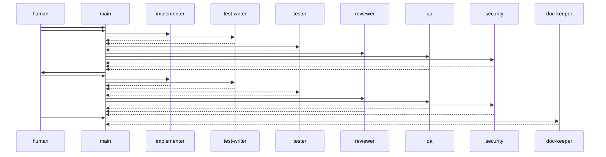

# 메시지 흐름

```mermaid
sequenceDiagram
    participant Human as human
    participant Main as main
    participant implementer as implementer
    participant test-writer as test-writer
    participant tester as tester
    participant reviewer as reviewer
    participant qa as qa
    participant security as security
    participant doc-keeper as doc-keeper
    Human->>Main: #1 H-INPUT (~32 tok)
    Human->>Main: #2 H-INPUT (~2 tok)
    Main->>implementer: #3 T-TASK (~671 tok)
    Main->>test-writer: #4 T-TASK (~699 tok)
    implementer-->>Main: #5 R-DONE (~1488 tok)
    test-writer-->>Main: #6 R-DONE (~1638 tok)
    Main->>tester: #7 T-TASK (~238 tok)
    tester-->>Main: #8 R-DONE (~164 tok)
    Main->>reviewer: #9 T-TASK (~238 tok)
    Main->>qa: #10 T-TASK (~326 tok)
    Main->>security: #11 T-TASK (~253 tok)
    reviewer-->>Main: #12 R-FINDINGS (~1858 tok)
    security-->>Main: #13 R-FINDINGS (~2345 tok)
    qa-->>Main: #14 R-FINDINGS (~1882 tok)
    Main->>Human: #15 Q-ASK (~627 tok)
    Human->>Main: #16 H-ANSWER (~210 tok)
    Main->>implementer: #17 T-FIX (~550 tok)
    Main->>test-writer: #18 T-FIX (~544 tok)
    implementer-->>Main: #19 R-DONE (~962 tok)
    test-writer-->>Main: #20 R-DONE (~1395 tok)
    Main->>tester: #21 T-RERUN (~144 tok)
    tester-->>Main: #22 R-DONE (~335 tok)
    Main->>reviewer: #23 T-REREVIEW (~192 tok)
    Main->>qa: #24 T-REREVIEW (~312 tok)
    Main->>security: #25 T-REREVIEW (~203 tok)
    qa-->>Main: #26 R-FINDINGS (~828 tok)
    reviewer-->>Main: #27 R-FINDINGS (~1053 tok)
    security-->>Main: #28 R-FINDINGS (~1440 tok)
    Human->>Main: #29 H-INPUT (~2 tok)
    Main->>doc-keeper: #30 T-TASK (~374 tok)
    doc-keeper-->>Main: #31 R-DONE (~445 tok)
```
