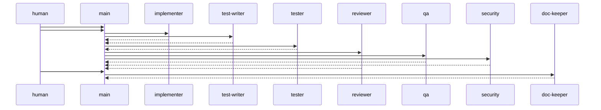

# 메시지 흐름

```mermaid
sequenceDiagram
    participant Human as human
    participant Main as main
    participant implementer as implementer
    participant test-writer as test-writer
    participant tester as tester
    participant reviewer as reviewer
    participant qa as qa
    participant security as security
    participant doc-keeper as doc-keeper
    Human->>Main: #1 H-INPUT (~32 tok)
    Human->>Main: #2 H-INPUT (~2 tok)
    Main->>implementer: #3 T-TASK (~800 tok)
    Main->>test-writer: #4 T-TASK (~714 tok)
    implementer-->>Main: #5 R-DONE (~1708 tok)
    test-writer-->>Main: #6 R-DONE (~1925 tok)
    Main->>tester: #7 T-TASK (~307 tok)
    tester-->>Main: #8 R-DONE (~157 tok)
    Main->>reviewer: #9 T-TASK (~337 tok)
    Main->>qa: #10 T-TASK (~328 tok)
    Main->>security: #11 T-TASK (~310 tok)
    qa-->>Main: #12 R-FINDINGS (~1514 tok)
    security-->>Main: #13 R-FINDINGS (~3245 tok)
    reviewer-->>Main: #14 R-FINDINGS (~2088 tok)
    Human->>Main: #15 H-INPUT (~2 tok)
    Main->>doc-keeper: #16 T-TASK (~380 tok)
    doc-keeper-->>Main: #17 R-DONE (~452 tok)
```
