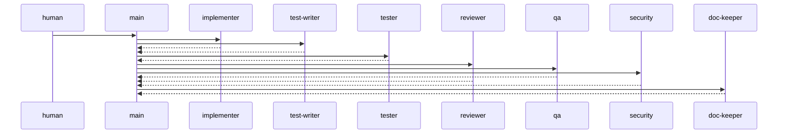

# 메시지 흐름

```mermaid
sequenceDiagram
    participant Human as human
    participant Main as main
    participant implementer as implementer
    participant test-writer as test-writer
    participant tester as tester
    participant reviewer as reviewer
    participant qa as qa
    participant security as security
    participant doc-keeper as doc-keeper
    Human->>Main: #1 H-INPUT (~31 tok)
    Main->>implementer: #2 T-TASK (~600 tok)
    Main->>test-writer: #3 T-TASK (~562 tok)
    implementer-->>Main: #4 R-DONE (~1165 tok)
    test-writer-->>Main: #5 R-DONE (~1905 tok)
    Main->>tester: #6 T-TASK (~262 tok)
    tester-->>Main: #7 R-DONE (~182 tok)
    Main->>reviewer: #8 T-TASK (~272 tok)
    Main->>qa: #9 T-TASK (~307 tok)
    Main->>security: #10 T-TASK (~249 tok)
    qa-->>Main: #11 R-FINDINGS (~1422 tok)
    reviewer-->>Main: #12 R-FINDINGS (~1770 tok)
    security-->>Main: #13 R-FINDINGS (~2060 tok)
    Main->>doc-keeper: #14 T-TASK (~410 tok)
    doc-keeper-->>Main: #15 R-DONE (~472 tok)
```
