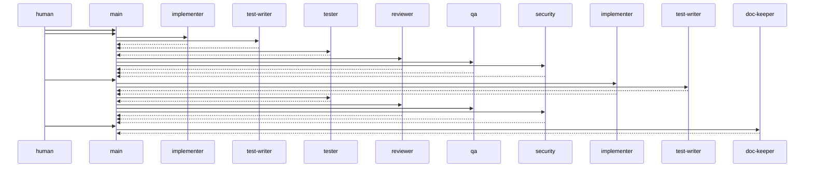

# 메시지 흐름

```mermaid
sequenceDiagram
    participant Human as human
    participant Main as main
    participant implementer as implementer
    participant test-writer as test-writer
    participant tester as tester
    participant reviewer as reviewer
    participant qa as qa
    participant security as security
    participant implementer_2 as implementer#2
    participant test-writer_2 as test-writer#2
    participant doc-keeper as doc-keeper
    Human->>Main: #1 H-INPUT (~32 tok)
    Human->>Main: #2 H-INPUT (~2 tok)
    Main->>implementer: #3 T-TASK (~609 tok)
    Main->>test-writer: #4 T-TASK (~582 tok)
    implementer-->>Main: #5 R-DONE (~1255 tok)
    test-writer-->>Main: #6 R-DONE (~2331 tok)
    Main->>tester: #7 T-TASK (~256 tok)
    tester-->>Main: #8 R-DONE (~230 tok)
    Main->>reviewer: #9 T-TASK (~294 tok)
    Main->>qa: #10 T-TASK (~354 tok)
    Main->>security: #11 T-TASK (~283 tok)
    reviewer-->>Main: #12 R-FINDINGS (~2214 tok)
    qa-->>Main: #13 R-FINDINGS (~1530 tok)
    security-->>Main: #14 R-FINDINGS (~2714 tok)
    Human->>Main: #15 H-INPUT (~5 tok)
    Main->>implementer_2: #16 T-TASK (~603 tok)
    Main->>test-writer_2: #17 T-TASK (~614 tok)
    test-writer_2-->>Main: #18 R-DONE (~964 tok)
    implementer_2-->>Main: #19 R-DONE (~780 tok)
    Main->>tester: #20 T-RERUN (~234 tok)
    tester-->>Main: #21 R-DONE (~302 tok)
    Main->>reviewer: #22 T-REREVIEW (~249 tok)
    Main->>qa: #23 T-REREVIEW (~287 tok)
    Main->>security: #24 T-REREVIEW (~260 tok)
    reviewer-->>Main: #25 R-FINDINGS (~1295 tok)
    qa-->>Main: #26 R-FINDINGS (~851 tok)
    security-->>Main: #27 R-FINDINGS (~1740 tok)
    Human->>Main: #28 H-INPUT (~2 tok)
    Main->>doc-keeper: #29 T-TASK (~630 tok)
    doc-keeper-->>Main: #30 R-DONE (~449 tok)
```
