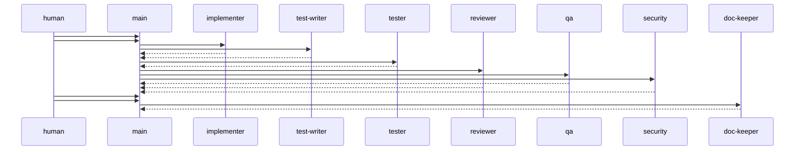

# 메시지 흐름

```mermaid
sequenceDiagram
    participant Human as human
    participant Main as main
    participant implementer as implementer
    participant test-writer as test-writer
    participant tester as tester
    participant reviewer as reviewer
    participant qa as qa
    participant security as security
    participant doc-keeper as doc-keeper
    Human->>Main: #1 H-INPUT (~32 tok)
    Human->>Main: #2 H-INPUT (~4 tok)
    Main->>implementer: #3 T-TASK (~603 tok)
    Main->>test-writer: #4 T-TASK (~610 tok)
    implementer-->>Main: #5 R-DONE (~1065 tok)
    test-writer-->>Main: #6 R-DONE (~2526 tok)
    Main->>tester: #7 T-TASK (~210 tok)
    tester-->>Main: #8 R-DONE (~159 tok)
    Main->>reviewer: #9 T-TASK (~279 tok)
    Main->>qa: #10 T-TASK (~387 tok)
    Main->>security: #11 T-TASK (~310 tok)
    qa-->>Main: #12 R-FINDINGS (~1668 tok)
    reviewer-->>Main: #13 R-FINDINGS (~2455 tok)
    security-->>Main: #14 R-FINDINGS (~2450 tok)
    Human->>Main: #15 H-INPUT (~8 tok)
    Human->>Main: #16 H-INPUT (~2 tok)
    Main->>doc-keeper: #17 T-TASK (~466 tok)
    doc-keeper-->>Main: #18 R-DONE (~395 tok)
```
