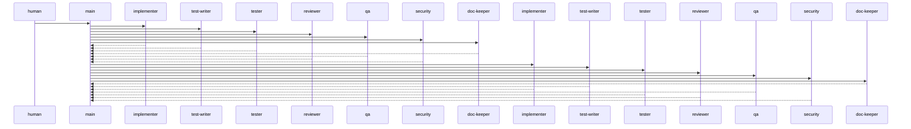

# 메시지 흐름

```mermaid
sequenceDiagram
    participant Human as human
    participant Main as main
    participant implementer as implementer
    participant test-writer as test-writer
    participant tester as tester
    participant reviewer as reviewer
    participant qa as qa
    participant security as security
    participant doc-keeper as doc-keeper
    participant implementer_2 as implementer#2
    participant test-writer_2 as test-writer#2
    participant tester_2 as tester#2
    participant reviewer_2 as reviewer#2
    participant qa_2 as qa#2
    participant security_2 as security#2
    participant doc-keeper_2 as doc-keeper#2
    Human->>Main: #1 H-INPUT (~24 tok)
    Main->>implementer: #2 T-TASK (~50 tok)
    Main->>test-writer: #3 T-TASK (~50 tok)
    Main->>tester: #4 T-TASK (~50 tok)
    Main->>reviewer: #5 T-TASK (~50 tok)
    Main->>qa: #6 T-TASK (~50 tok)
    Main->>security: #7 T-TASK (~50 tok)
    Main->>doc-keeper: #8 T-TASK (~50 tok)
    implementer-->>Main: #9 R-DONE (~4 tok)
    test-writer-->>Main: #10 R-DONE (~4 tok)
    tester-->>Main: #11 R-DONE (~4 tok)
    doc-keeper-->>Main: #12 R-DONE (~4 tok)
    qa-->>Main: #13 R-FINDINGS (~4 tok)
    reviewer-->>Main: #14 R-FINDINGS (~4 tok)
    security-->>Main: #15 R-FINDINGS (~4 tok)
    Main->>implementer_2: #16 T-TASK (~50 tok)
    Main->>test-writer_2: #17 T-TASK (~50 tok)
    Main->>tester_2: #18 T-TASK (~50 tok)
    Main->>reviewer_2: #19 T-TASK (~50 tok)
    Main->>qa_2: #20 T-TASK (~50 tok)
    Main->>security_2: #21 T-TASK (~50 tok)
    Main->>doc-keeper_2: #22 T-TASK (~50 tok)
    doc-keeper_2-->>Main: #23 R-DONE (~4 tok)
    test-writer_2-->>Main: #24 R-DONE (~4 tok)
    implementer_2-->>Main: #25 R-DONE (~4 tok)
    qa_2-->>Main: #26 R-FINDINGS (~4 tok)
    tester_2-->>Main: #27 R-DONE (~4 tok)
    reviewer_2-->>Main: #28 R-FINDINGS (~4 tok)
    security_2-->>Main: #29 R-FINDINGS (~4 tok)
```
